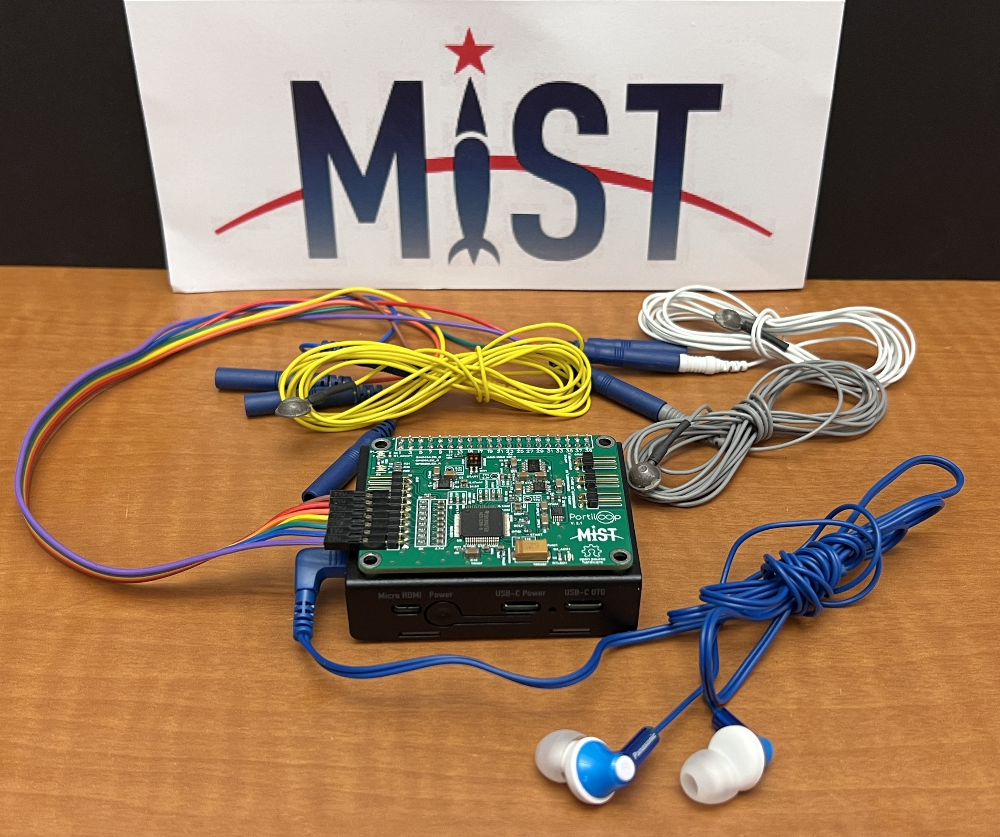
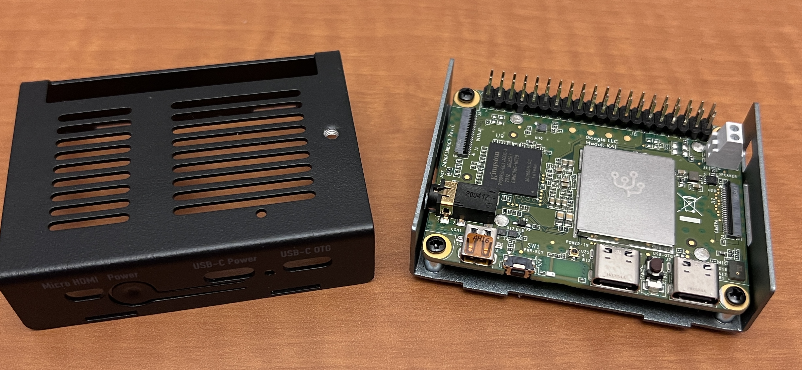
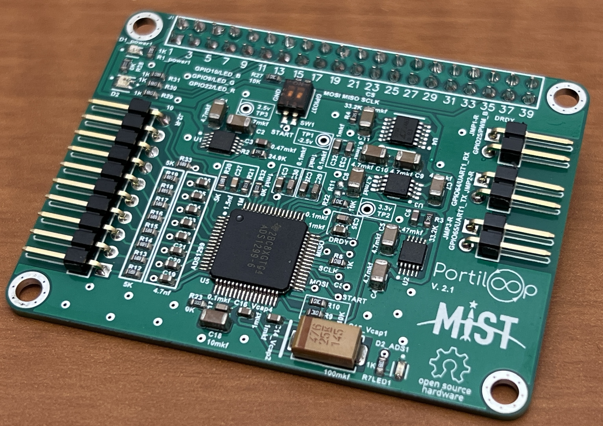
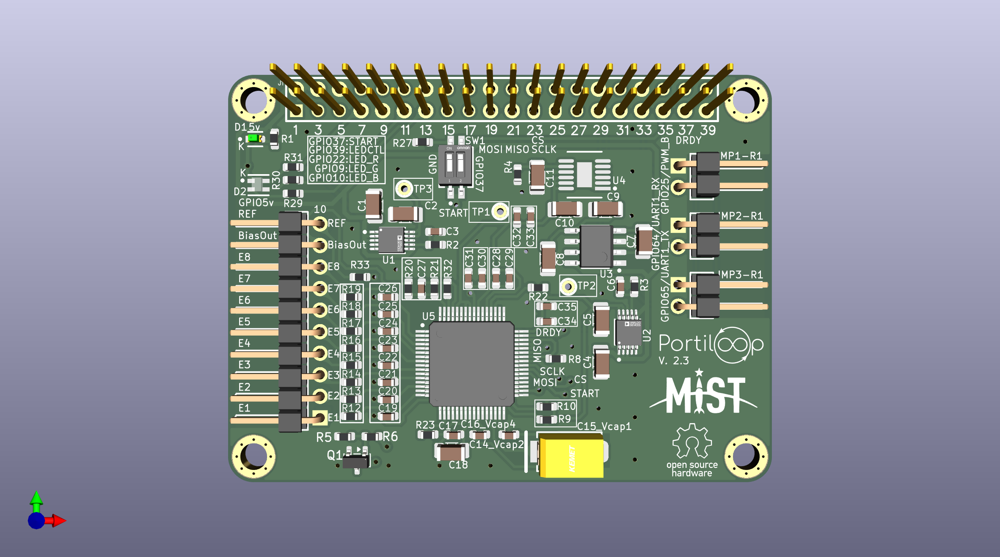
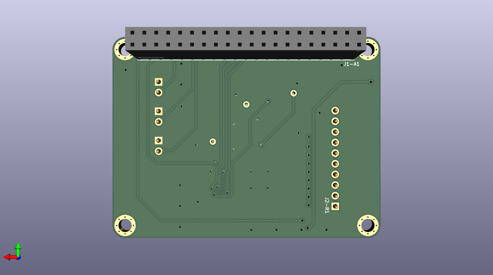

# Portiloop hardware

This repository documents hardware implementations of the `Portiloop` device. 
Which is a portable EEG closed-loop stimulation device.
[The software repository](https://github.com/Portiloop/portiloop-software) enables controlling the device from a simple Graphical User Interface (GUI).

The last hardware iteration of the `Portiloop` device consists of a PCB built around an [ADS1299 chip](https://www.ti.com/product/ADS1299) 
with connectors for a [Coral Dev Board Mini](https://coral.ai/products/dev-board-mini/#documentation).
The `ADS1299` is an ADC responsible for processing analog EEG signal.

This repository open-sources all relevant plans for building this implementation.

