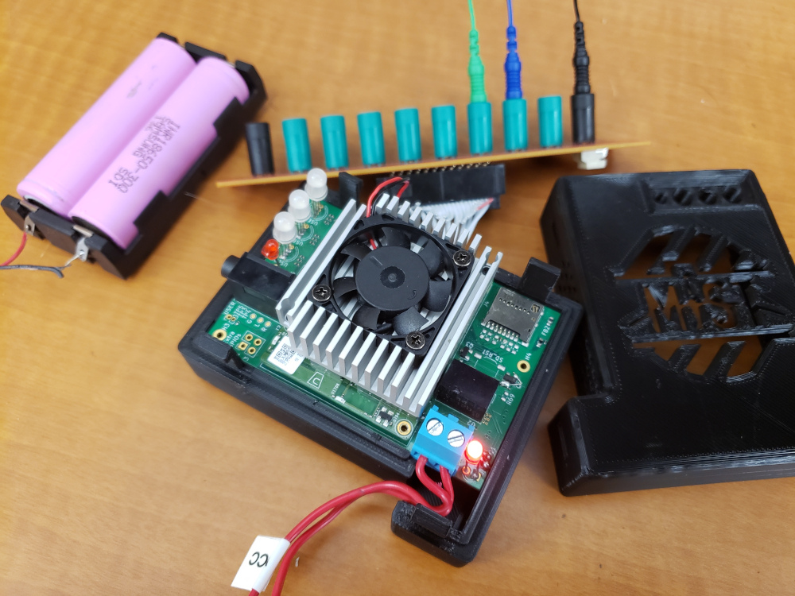
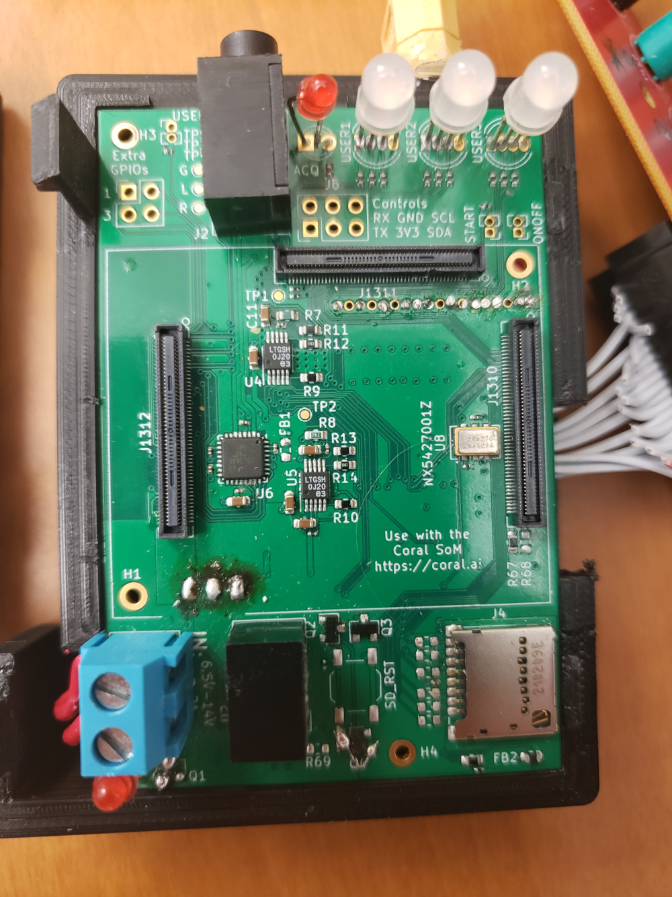
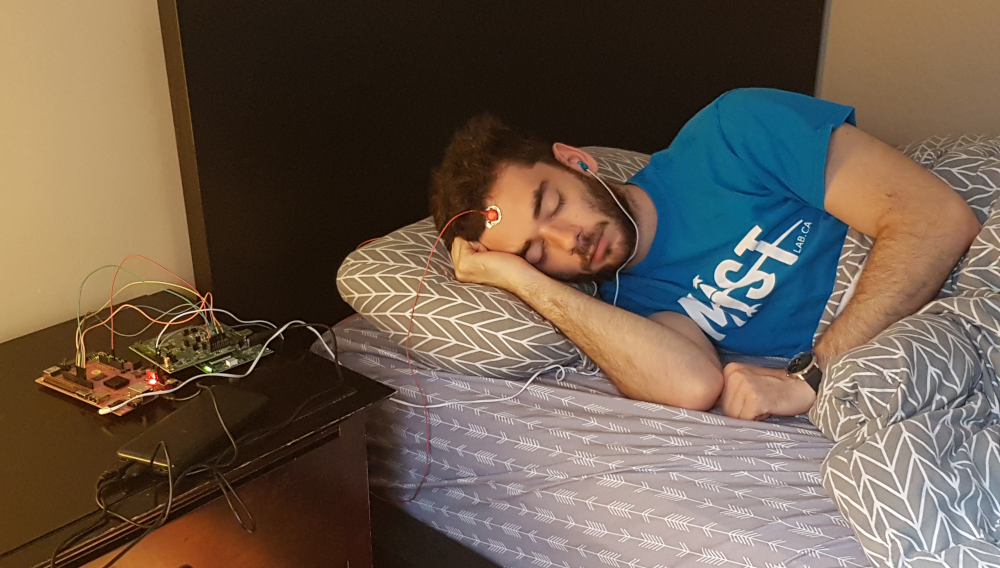

# Portiloop hardware

This repository documents hardware implementations of the `Portiloop` device.

## TPU-based implementation

The last hardware iteration of the `Portiloop` device consists of a PCB built around an [ADS1299 chip](https://www.ti.com/product/ADS1299) with connectors for a [Coral SoM](https://coral.ai/products/som).
The `ADS1299` is an ADC responsible for processing analog EEG signal, and the `Coral` board embeds a TPU for deep neural network inference.

This repository open-sources all relevant plans for building this implementation.

Once built, the PCB fits in the 3D-printable `Portiloop` case, and the `Coral` SoM is easy to connect:

## FPGA-based implementation

It is also possible to implement the `Portiloop` device on an FPGA system, which we have done in a previous prototype using an [HackEEG](https://www.crowdsupply.com/starcat/hackeeg) development board and a [PYNQ-enabled board](http://www.pynq.io).
This implementation is harder to adapt to your application, because neural blocks and filters are directly implemented in FPGA circuitry.
The code of our FPGA prototype is open-sourced under the `FPGA` folder for interested industrials.

